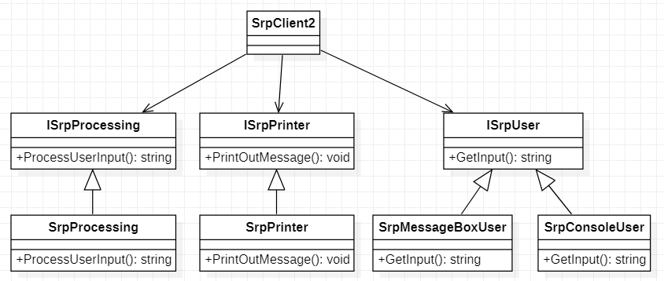
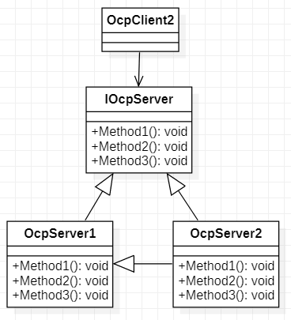
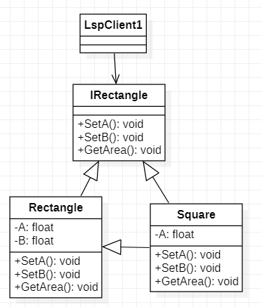
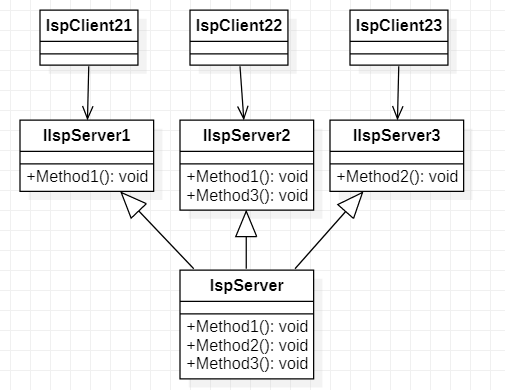

# SOLID 

Read this in other languages: [English](solid.md), [Russian/Русский](solid.ru.md). 

**SOLID** is a mnemonic acronym for five design principles intended to make object-oriented designs more understandable, flexible, and maintainable:
- **S**ingle-responsibility principle;
- **O**pen-closed principle;
- **L**iskov substitution principle;
- **I**nterface segregation principle;
- **D**ependency-inversion principle.

## Single-responsibility principle

A class should have only one reason to change. 

### Bad

### Better

## Open-closed principle

A software entity should be open for extension but closed for modification. 

### Bad

### Better

## Liskov substitution principle

Classes that use pointers or references to base class must be able to use objects of derived class without knowing it. 

### Bad

### Better

One of the possible options to solve the **LSP** problem is presented at [this link](https://github.com/alexeysp11/mindbox-lib).

## Interface segregation principle

Classes should not be forced to depend upon interfaces that they don't use. 

### Bad

### Better

## Dependency-inversion principle

Depend upon abstractions, but not concretions. 

### Bad

### Better

